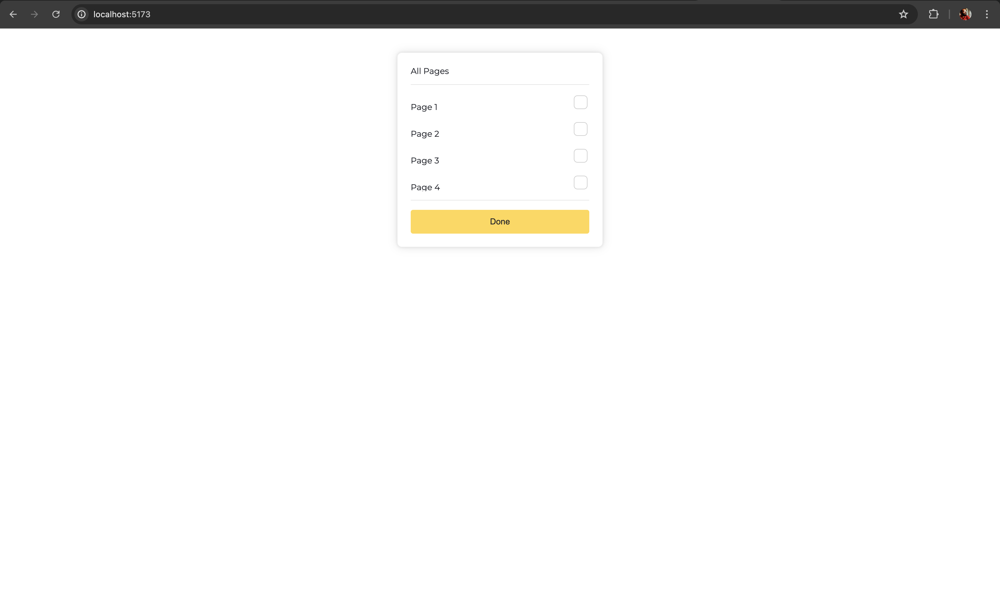

# ASSESMEENT FOR ELLTY
### The project is built with vite + react along with CSS.

## Steps to run the code
1. Clone the repository.
2. Run `npm install` to install the dependencies.
3. Run `npm run dev`

>Please feel free to interact with the button. The button is disable if no items are selected otherwise shows a toast with the selected elements.

